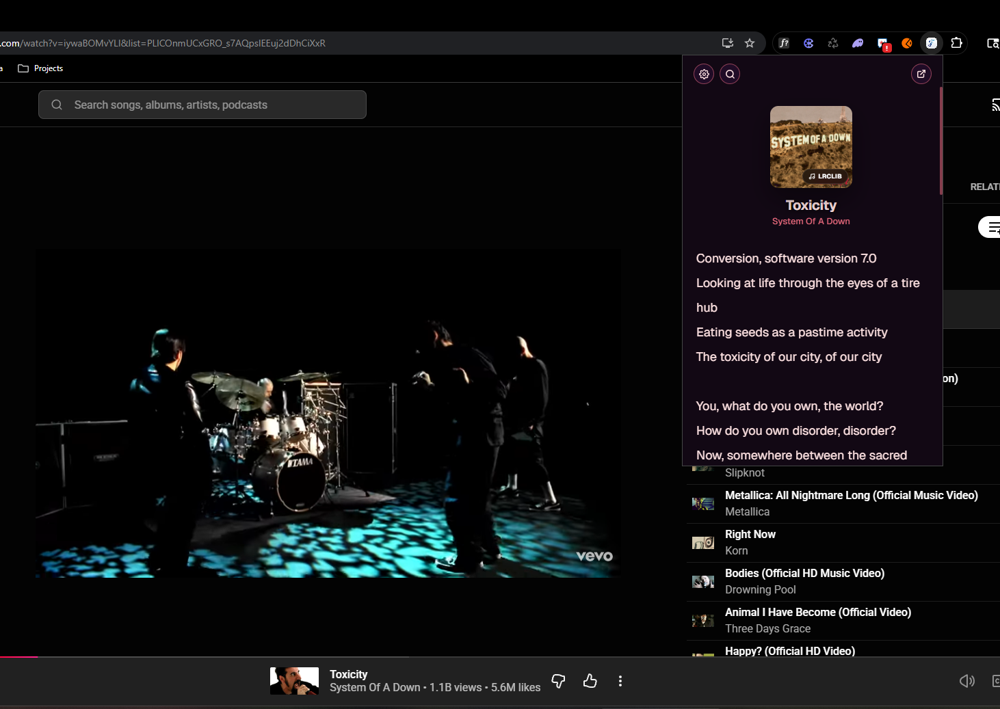
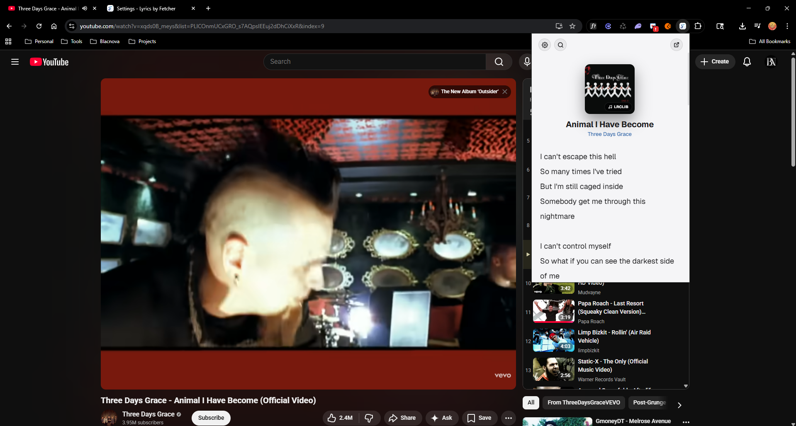

# Lyrics by Fetcher for YouTube & YouTube Music

Lyrics by Fetcher is a browser extension that automatically detects the song you’re playing on YouTube or YouTube Music, then fetches and displays lyrics in a popup.

  

## Features

- **Instant Detection**: Seamlessly detects the track playing on YouTube and YouTube Music.
- **Advanced Title Normalization**: Strips away typical YouTube video artifacts (e.g., "[Official Video]", "ft.", "(Live)") to accurately deduce the base song and artist name.
- **Strict Accuracy Matching**: Uses Jaro-Winkler, Sørensen–Dice coefficient, and Levenshtein distance algorithms to ensure the lyrics retrieved strictly match your intent.
- **Multiple API Fallbacks**: Sequentially queries several top lyrics providers if one fails, guaranteeing the highest possible success rate.
- **Robust Caching**: Caches metadata and lyrics locally (for up to 14 days) to load your favorite songs instantly and save network requests.
- **Dynamic Backgrounds**: Extracts cover art via iTunes API (or falls back to YouTube thumbnails) to generate a beautiful, dynamic blur background for the lyrics view.

## Supported Lyric Sources

The extension fetches data sequentially from the following providers:
1. LRCLIB
2. Genius (via direct API & HTML Scraping)
3. Lyrist (Genius proxy)
4. Lyrics.ovh
5. SomeRandomAPI
6. ChartLyrics
7. LyricsAPI

## Customization & Options

Fetcher gives you complete control over your lyric-reading experience via the **Control Center** options page:

- **Themes**: Choose between System, Light, Dark, or build your own **Custom Theme** (Background, Card, Text, and Accent colors) using the built-in color picker.
- **Typography**: Select from curated fonts including Geist, Inter, DM Sans, Space Grotesk, DM Serif Text, or your System Default.
- **Sizing**: Adjust text size and the overall popup size to your preference.
- **Preferences**: Toggle dynamic backgrounds, local caching, sticky headers, and more.

## Installation

### From the Chrome Web Store
Simply click the [Download badge](#) at the top of this README to install it directly from the Chrome Web Store.

### Manual Installation (Developer Mode)
1. Clone this repository or download the source code as a ZIP file.
2. Open Google Chrome (or any Chromium-based browser) and navigate to `chrome://extensions/`.
3. Enable **"Developer mode"** in the top right corner.
4. Click on **"Load unpacked"** and select the root directory of this project (`fetcher-lyrics`).
5. Pin the extension to your toolbar and start playing a song on YouTube!

## Permissions

- **`tabs` & `scripting`**: Required to read the current tab's title and inject the content script to detect the active track on YouTube/YouTube Music.
- **`storage`**: Used to save your custom settings and locally cache lyrics to speed up load times.
- **`host_permissions`**: Required to bypass CORS and communicate with various lyrics API endpoints and YouTube. 

## Contributing

Pull requests and issues are welcome! If you notice a lyrics provider breaking or want to add a new API source, feel free to open a PR. Please make sure that any new APIs support CORS or are routed properly.

## License

This project is licensed under the MIT License.
